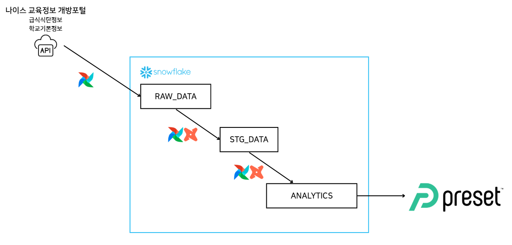
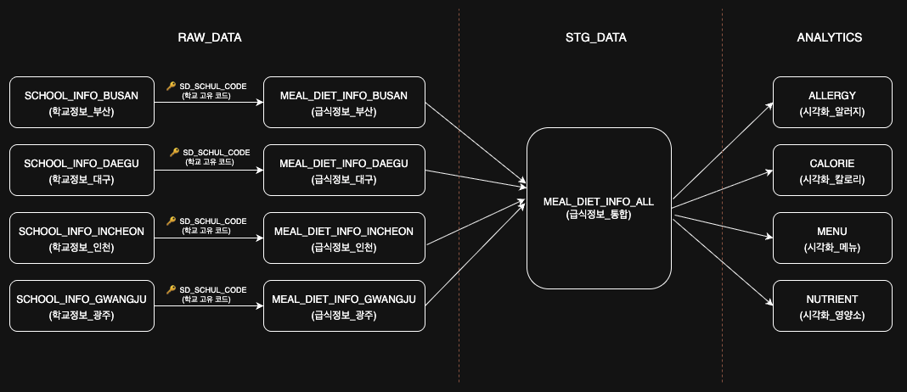
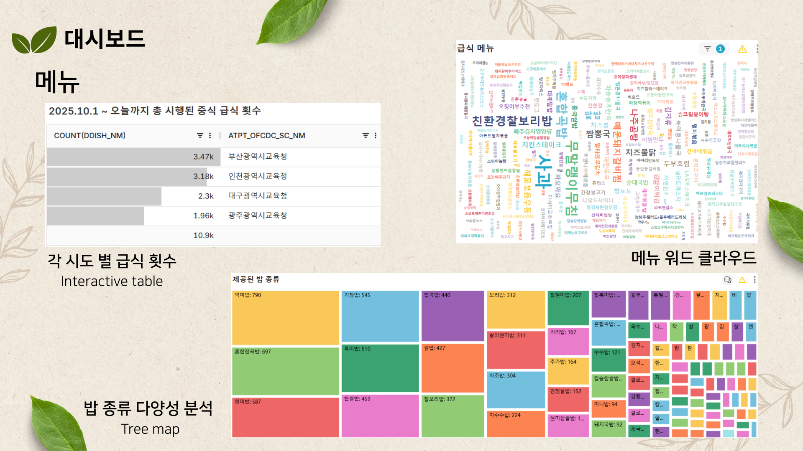
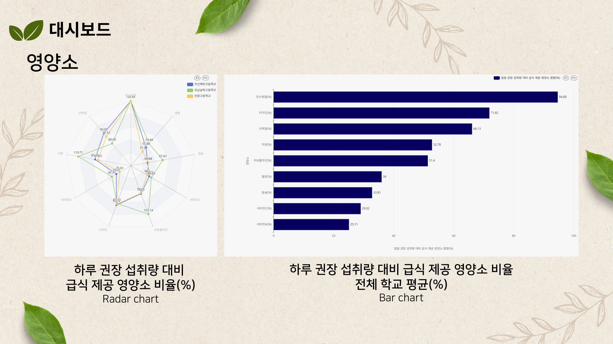
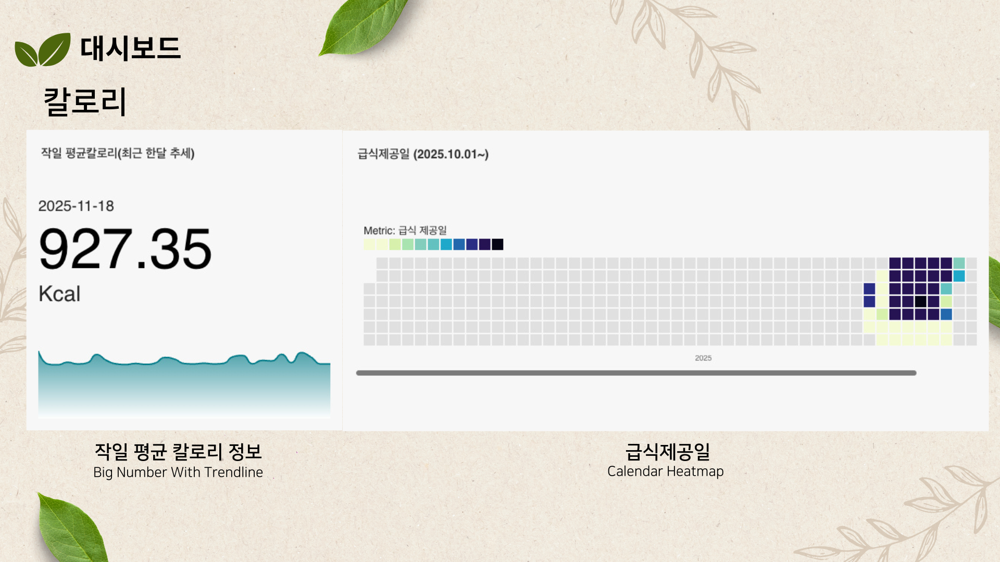
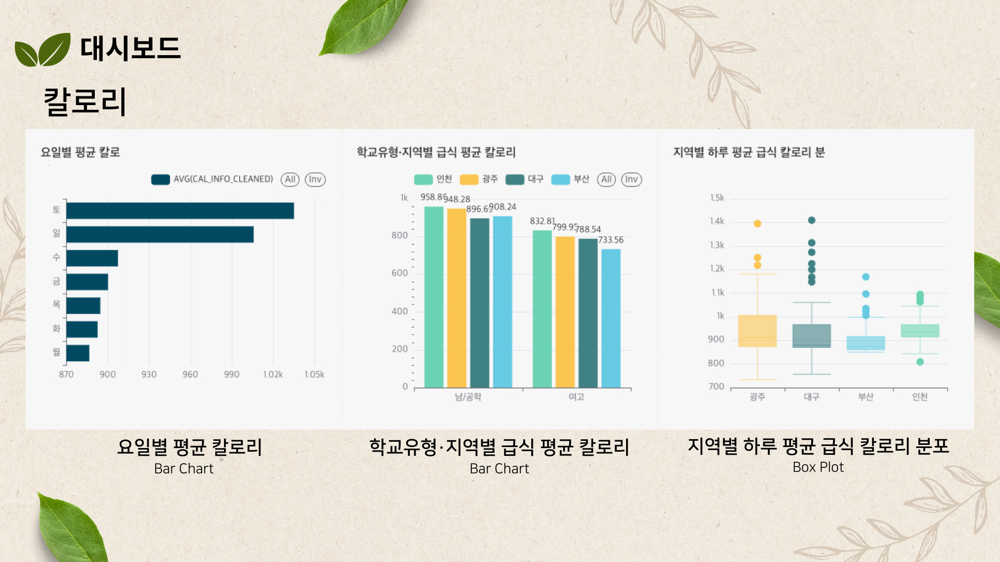
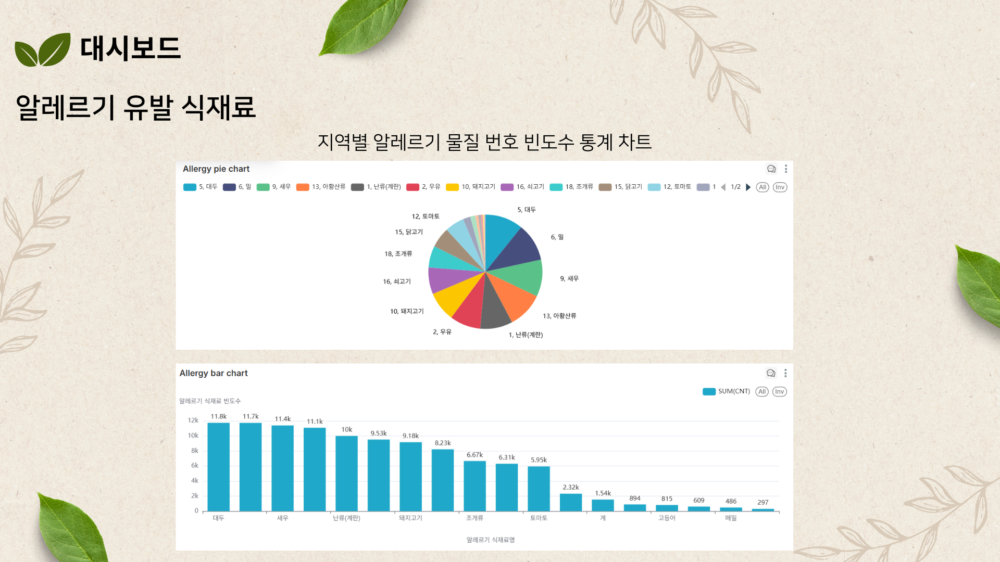

# 🍱 고등학교 급식 데이터 파이프라인 구축 및 분석 대시보드 
한국 고등학교 급식 데이터를 수집·정제·모델링·시각화하는 엔드투엔드(End-to-End) 데이터 엔지니어링 프로젝트입니다.

본 프로젝트는 [나이스 교육정보 개방 포털](https://open.neis.go.kr/portal/mainPage.do) 에서
API 호출을 통해 데이터를 수집했으며, Airflow · Snowflake · dbt 기반으로 
**자동화된 데이터 파이프라인**을 구현하는 것을 목표로 합니다.

프로젝트 기간:
2025.11.14 ~ 2025.11.19

팀 구성: 
**데브코스 데이터 엔지니어링 7기 – 3팀 (3차원)**

- 김예원
- 김재민
- 박정은
- 심훈

---

## 📌 프로젝트 개요

### > 사용 데이터
[나이스 교육정보 개방 포털](https://open.neis.go.kr/portal/mainPage.do) 에서 API 호출을 통해 수집한 데이터 사용
* [학교기본정보](https://open.neis.go.kr/portal/data/service/selectServicePage.do)
* [급식식단정보](https://open.neis.go.kr/portal/data/service/selectServicePage.do)

매일 갱신되기 때문에 데이터 엔지니어링 핵심 기술을 실습하기에 적합한 도메인이었습니다.


### > 프로젝트 달성 목표
- Airflow로 **매일 자동 수집**되는 데이터 파이프라인 구축
- Snowflake 기반 데이터웨어하우스 설계
- dbt로 **RAW_DATA → STG_DATA → ANALYTICS** 모델 계층 구성
- 메뉴·칼로리·영양소·알러지 정보를 활용한 **시각화 테이블 생성**


### > 기술 스택
| 영역 | 기술 |
|------|------|
| **Orchestration** | Apache Airflow |
| **Data Warehouse** | Snowflake |
| **Transformation** | dbt (Data Build Tool) |
| **Container** | Docker / Docker Compose |
| **Visualization (External)** | Superset |
| **ETL/ELT** | Python, REST API ingestion |


---

## 🌊 프로젝트 흐름도
### > 시스템 구조도
<p align="center">
    
</p>

- Apache Airflow의 DAG로 API 호출 및 Snowflake에 데이터 적재 및 자동화
- dbt 활용해 적재된 데이터 정제 및 과정 자동화
- 정제된 데이터 바탕으로 시각화, 대시보드 생성

---

## 📊 데이터 파이프라인 개요

```
NEIS API → Airflow DAG → Snowflake RAW → dbt STG → dbt ANALYTICS → Visualization
```

- **Airflow**: 스케줄링 & API 수집 자동화  
- **Snowflake RAW**: 원본 API 적재  
- **dbt STG**: 구조 변환·데이터 정제  
- **dbt ANALYTICS**: 메뉴/영양소/알러지/칼로리 분석 테이블 생성  

### > Snowflake 계층 구조
<p align="center">
    
</p>


---

## 📊 프로젝트 결과
<p align="center">
    
</p>
<p align="center">
    
</p>
<p align="center">
    
</p>
<p align="center">
    
</p>
<p align="center">
    
</p>


---

## 🏗️ 프로젝트 구조

```
energy-pipeline/
├── airflow/
│   ├── dags/              # DAG 파일들
│   ├── plugins/           # 커스텀 플러그인
│   ├── logs/              # Airflow 로그 (자동 생성)
│   └── Dockerfile         # Airflow 이미지 빌드 파일
├── meal_dbt/              # dbt 프로젝트
│   ├── models/            # dbt models 폴더
│   │   ├── sources/       # snowflake의 RAW_DATA 테이블 및 STG_DATA 테이블 연결 
│   │   ├── staging/       # STG_DATA schema에 MEAL_DIET_INFO_ALL 테이블 생성
│   │   └── analytics/     # 시각화용 테이블 생성
│   └── dbt_profiles       # profiles.yml 수정 필요
├── docker-compose.yml     # Docker Compose 설정
├── .env                   # 환경 변수 (생성 필요)
├── .env.example           # 환경 변수 예시
└── README.md              # 이 문서
```
---

## 🚀 설정 방법

### 1) 깃 클론

```bash
git clone git@github.com:devcourse-de7-3-team3/energy-pipeline.git
cd energy-pipeline
```

### 2) env 파일 복사하여 본인 정보 기입

```bash
# 환경변수 설정 예시파일을 .env로 생성
cp .env.example .env

# vi 혹은 IDE로 .env 파일 수정
# SNOWFLAKE_USER, SNOWFLAKE_PASSWORD 항목 각 본인 계정정보 수정
vi .env
```

### 3) airflow 실행

```bash
# 도커파일 빌드 및 실행
docker compose up -d

# 실행되기 확인
docker ps
```

### 4) 웹서버 접속
http://localhost:8081

### 5) 스노우플레이크 연결정보 Airflow Connection 자동 등록 DAG 실행

#### ① 웹에서 `init_snowflake_connection` DAG 수동 실행
#### ② Admin > Connection 에서 .env 파일 내 기재한 정보에 맞게 연결정보 등록됨 확인
#### ③ `test_snowflake_connection` DAG 실행하여 snowflake 정상 연결 확인
---

## 📊 프로젝트 세부사항

[프로그래머스 데이터엔지니어링 - Team 3차원 프로젝트 보고서](https://www.notion.so/3-End-to-end-11-14-11-20-24d6e9180a96814d9d3bc9589c58e976?p=2b06e9180a968047ac0dcecbc53e50f9&pm=s) 

---